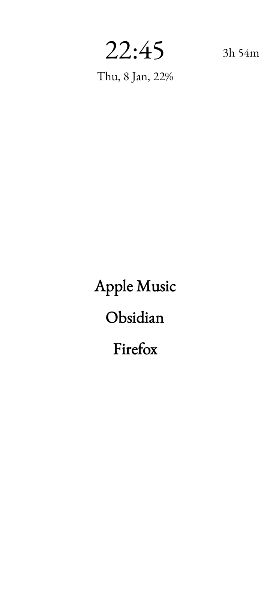
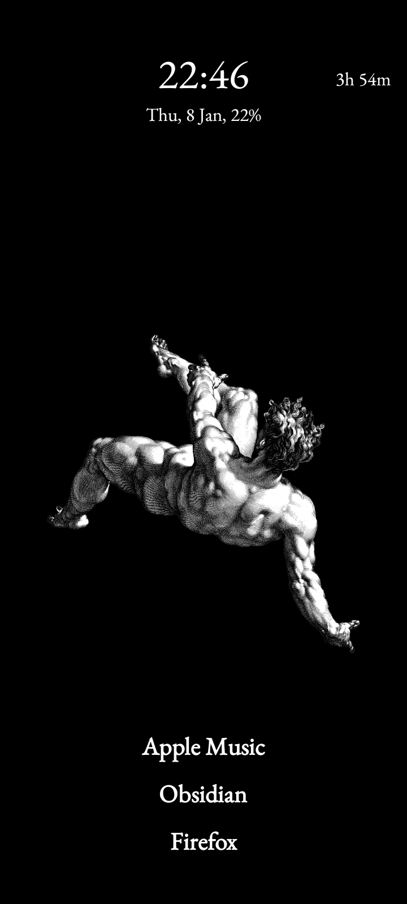
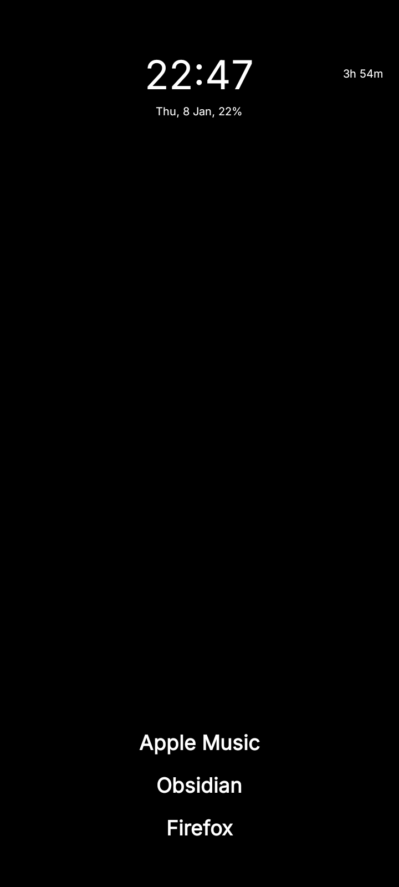

    <h1>Slauncher</h1>
    
    
A minimal, privacy-first Android launcher.

Slauncher is a lightweight Android launcher focused on simplicity, privacy, and customization. It is designed to stay out of your way and give you the essentials without ads or data collection.

## Screenshots

    
    
    

## Features

- **Minimal UI**: clean, distraction-free home experience.
- **Ad-free**: no ads anywhere in the launcher.
- **Privacy-respecting**: does not collect or send user data.
- **Custom fonts**: choose and apply fonts from settings.

## License

- This project is licensed under the GNU General Public License v3 (GPLv3). See the [LICENSE](./LICENSE) file for details.

## Inspiration

- Forked from and inspired by [tanujnotes/olauncher](https://github.com/tanujnotes/olauncher).
  - _**Note**: Slauncher does not include the daily wallpapers feature from the original project. (Coz I didn't use it)_
